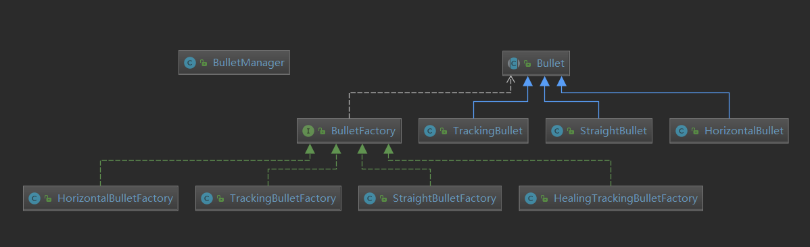

# JAVA Final Project

> ###### 161210005 何峰彬

## 效果展示


## 使用说明
使用mvn clean test package编译，生成的jar包为./target/HuLuBattle.jar

战场大小为16*12的棋盘，战斗(录像)开始前/结束后按F切换怪物阵型，L选择录像文件(.mylog)并自动播放，空格开始战斗，在每次战斗结束后会在当前目录下生成上一次战斗的录像文件(default.mylog)

可在./src/main/resources/character.properties配置文件中修改角色属性， **如使用jar包运行程序则每次修改配置文件需重新生成一次jar包，因为配置文件位于资源文件夹中。**

目前可供修改的属性有：
* 子弹类型
* 血量
* 攻击力
* 攻击频率
* 攻击范围
* 移动速度

以下是各个属性的详细说明

### 子弹类型
* 水平子弹：射程无限，当前行存在敌人就有概率发射
* 直线子弹：射程由属性中的攻击范围决定，会捕获以当前角色为中心，边长为2*range正方形区域内的所有敌人，并向所有敌人的方向发射一枚子弹，子弹射出后不再改变方向
* 追踪子弹：捕获敌人与直线子弹相同，但是子弹会自动追踪目标，直到触碰到目标或其他敌人为止
* 治疗子弹：为爷爷和蛇精专属（当然你也可以给别的角色装备），和追踪子弹类似，但目标是友方且有治愈效果

### 血量
角色所能承受的伤害量，为0时角色死亡

### 攻击力
角色发射的子弹的威力 or 治愈力，这取决于子弹的具体类型

### 攻击频率
在每个角色行动的时刻，它有一定的概率选择攻击或是进行位移，攻击的概率由配置文件中的**XXfre**来决定，XX为角色名，计算的公式为XXfre/minfre，所以XXfre越大攻击频率越低

### 攻击范围
定义了特定子弹的捕获半径，这里说是半径其实是以角色为中心的正方形边长的一半，若某个时刻角色决定攻击，则在捕获范围内的敌人(或队友)均会收到一颗子弹:-)，若捕获范围内没有敌人(或队友)则角色会进行移动而不是攻击。攻击范围这一属性的作用子弹包括除水平子弹外的所有子弹

### 移动速度
角色行动的频率(攻击 or 位移)，计算方式是每500ms/speed行动一次

## 游戏设定
**以下设定为默认设定，可在配置文件中自行修改**

| 角色 | 子弹类型 | 血量 |攻击力| 攻击频率 | 攻击范围 | 移动速度 | 考据 |
| ---- | --- | :---: | :---: | :----: | :----: | :----: | -------|
| 大娃 | 水平子弹 | 200 | 50 | 1 | - | 1.0 |力大无穷，标准莽夫|
|二娃|直线子弹|100|10|0.3|16|1.0|看得远，射得也远|
|三娃|水平子弹|500|40|0.5|-|1.0|铜墙铁壁，能打能抗|
|四娃|追踪子弹|100|10|0.3|7|1.0|众所周知，火球术是指向性的|
|五娃|追踪子弹|100|10|0.3|7|1.0|众所周知，水球术也是指向性的|
|六娃|水平子弹|100|30|0.3|-|2.0|他们说，只要抖动得够快，子弹就追不上我|
|七娃|追踪子弹|100|10|0.3|-|1.0|哥哥带我~|
|爷爷|治疗子弹|80|20|0.2|10|1.0|蛇精你退群吧|
|蛇精|治疗子弹|50|10|0.2|10|1.0|小的们给我上~|
|蝎子精|直线子弹|1000|15|0.3|5|0.7|最强肉盾|
|喽啰|水平子弹|100|10|0.3|-|1.0|死跑龙套的|

**隐藏机制**
在爷爷或蛇精死亡之时，悲愤交加的葫芦娃们/反派们痛苦地喊出“爷——爷——”/“大姐——大——”，随后这股愤怒化为力量冲破了科学的桎梏，沸腾的血液激活了蚀刻在基因中的~~外挂~~技能。**"Wryyyyyyyyyy!!! ~~AAAArthur..~~"**
``` java
public void Wryyyyy(){
    speed *= 5;
    range = 10;
    if(bulletFactory instanceof HorizontalBulletFactory) {
        bulletFactory = new StraightBulletFactory();
    }
}
```

## 设计说明

### 生物类

继承关系如上所示，相比Homework3，最大的改变是基类Creature实现了Runnable接口，于是每个生物将作为一个独立的线程存在，这也更符合现实的逻辑。
``` java
@Override
public void run(){
    while(true){
        int timeGap = (int)(500/speed);
        try{
            TimeUnit.MILLISECONDS.sleep(timeGap);
            synchronized (battleField) {
                //一觉醒来发现仗打完了 or 自己挂了
                if (isDead || !battleField.isBattle)
                    break;
                if (random.nextInt(attackFrequency) < minAttackFrequency) {
                    if (!shoot())
                        randomWalk();
                } else
                    randomWalk();
            }
        }catch (Exception e){
            e.printStackTrace();
            break;
        }
    }
    ...
}
```
同时，每个生物拥有了一系列属性和读取属性的方法`final void setAttributes()`，通过自由地搭配属性尝试不同的组合，游戏的可玩性也有了质的提升。

### 子弹类

具体的子弹继承自基类Bullet，构造函数`Bullet(Creature shooter, Creature target)`在基类Bullet除了各种共性的操作外，还定义了一个抽象方法`abstruct public void move(int millisec)`，这个方法用于定义具体子弹的移动方式，这也是各个具体子弹的不同之处，只要实现这个方法就能很方便地实现不同类型的子弹。

BulletManager中使用LinkedList来保存某个时刻战场上的所有子弹`private final List<Bullet> bullets = new LinkedList<>()`，包括三个public接口
``` java
public void move(...){...}
public void display(...){...}
public void clear(){...}
```
move方法用于移动它管理的所有子弹并触发相应的伤害事件，这里使用了代理设计模式；display方法用于在图形界面上显示所有的子弹；clear则用于清除所有子弹。

同时我还使用工厂设计模式，定义了一个抽象的工厂接口，进一步将生物类和子弹类进行解耦，每个生物只知道自己有生产子弹的能力，但不知道生产的具体子弹类型，便于动态地改变子弹类型

``` java
public interface BulletFactory<T extends Bullet> {
    T getBullet(Creature shooter, Creature target);
}
```

### 生物类和子弹类的组合
在每个Creature对象中保存着一个BulletFactory，每个生物有捕获目标和发射子弹的能力，根据子弹的不同，捕获目标的方式也有所不同
``` java
final List<Creature> getTargets(){
    if(bulletFactory instanceof HorizontalBulletFactory)
        return captureRowEnemies();
    else if(bulletFactory instanceof HealingTrackingBulletFactory)
        return captureNearFriends();
    else
        return captureNearEnemies();
}
```

于是shoot方法的实现如下
``` java
public boolean shoot(){
    List<Creature> targets = getTargets();
    for(Creature target: targets){
        battleField.addBullet(bulletFactory.getBullet(this, target));
    }
    return !targets.isEmpty();
}
```

### GUI设计
我的GUI控制十分简单，控制逻辑定义在BattleController类中，这也是主界面的控制类，整个流程基于键盘事件的监听
``` java
if(battleField.isBattle || (reviewer!=null && reviewer.isReviewing()))
    return;
if(event.getCode() == KeyCode.F){
    changeFormation();
}else if(event.getCode() == KeyCode.SPACE ){
    startBattle();
}else if(event.getCode() == KeyCode.L){
    startReview();
}
```
而每帧的画面显示，一开始我是通过另一个线程实现
``` java
new Thread(new Runnable{
    public void run(){
        ...
        while(isBattle){
            sleep(20ms);
            draw();
        }
        ...
    }
})
```
但是使用这样的实现会带来问题，具体表现是会在某个不确定的时刻画面静止不再刷新，而后台的程序仍在正常运行，原因是javaFX并不是线程安全的，参见[Concurrency in JavaFX](https://docs.oracle.com/javase/8/javafx/interoperability-tutorial/concurrency.htm)
> The JavaFX scene graph, which represents the graphical user interface of a JavaFX application, is not thread-safe and can only be accessed and modified from the UI thread also known as the JavaFX Application thread.

于是我决定使用Timeline实现，再通过另一个线程的监听来结束timeline循环
``` java
Timeline timeline = new Timeline(
        new KeyFrame(Duration.millis(0),
                event1 -> {
                    battleField.bulletManager.move(TIME_GAP);
                    draw();
                    recorder.writeStop();
                }),
        new KeyFrame(Duration.millis(TIME_GAP))
);
timeline.setCycleCount(Timeline.INDEFINITE);
timeline.play();

new Thread(new Runnable{
    public void run{
        ....
        while(isBattle){
            sleep(TIME_GAP);
        }
        timeline.stop();
        ...
    }
}
```

### 回放机制
主要思路是将每帧画面的所有信息进行保存，包括每个生物（包括墓碑）的位置，生物的状态（血量，死活等）以及每个子弹的位置。在回放时只需要通过每帧的信息并根据这些信息绘制画面即可。信息的记录和读取主要由logger.Recorder和logger.Reviewer负责。Recorder的接口如下，构造方法中的rate指定录像的帧率，writeStop()用于分割每帧的画面，其余方法顾名思义
``` java
public Recorder(int rate);
public void write(Creature creature);
public void write(Bullet bullet);
public void writeStop();
public void writeWinner(boolean win);
public void finish();
```
Reviewer负责从记录文件中读取信息，最重要的接口为`public void getOneFrame()`，返回记录下一帧画面所有信息的字符串，然后BattleController类根据这个字符串通过方法`void drawFrameViaStr(String str)`进行画面的绘制

## 面向对象
### 机制
* 继承：所有的生物都是Creature的子类，所有的子弹都是Bullet的子类，所有的阵型都实现了Formation接口
* 多态：主要体现在生物类和子弹类上，所有的生物都是Creature却有不同的行为，所有的子弹都是Bullet却又有不同的移动方式
* 封装：每个类的具体数据成员和方法实现都是隐藏的。类的使用者只能通过接口进行数据的操作，比如生物的各个属性就被定义为private成员，外界不可访问。同时类的使用者也不必关心接口的具体实现，便于后续的修改
* 泛型：子弹工厂的定义和Sorter的静态方法sort都用到了泛型，使其能作用于不同的对象，实现了代码的复用
* RTTI: 主要体现在生物捕获目标时，使用了instanceof关键字进行运行时类型判断

### 设计模式
* 工厂模式：每个生物类中都保存了一个子弹工厂，进一步将生物和子弹进行解耦
* 代理模式：BattleField类是每个Creature和BulletManager的代理，而BulletManager又是所有Bullet的代理

## 致谢
经过一学期Java课程的~~摧残~~学习，和大作业的~~虐待~~磨练，我也从一个对面向对象程序设计一无所知且充满鄙夷的小白，成长为了一个对面向对象程序设计略知一二的小白，并且充分体会到了用代码模拟现实的乐趣所在。多年后或许我不会成为一名Java程序员，但一想到面向对象，我的脑海中一定会浮现两位老师的生动教诲。**感谢老师和助教大大们一学期的辛勤付出**